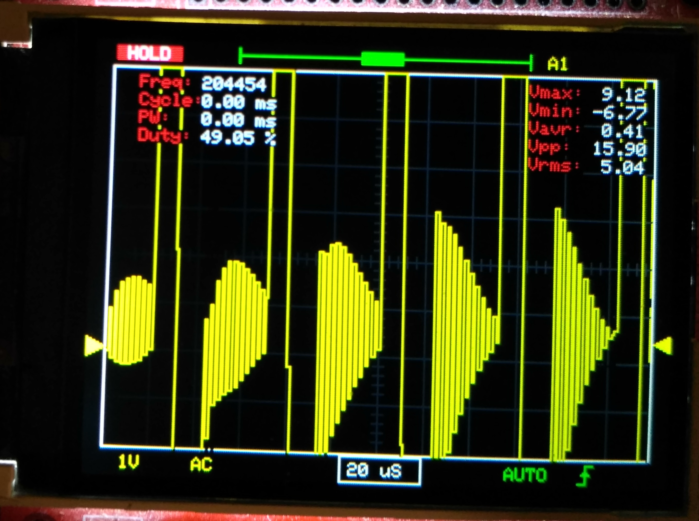
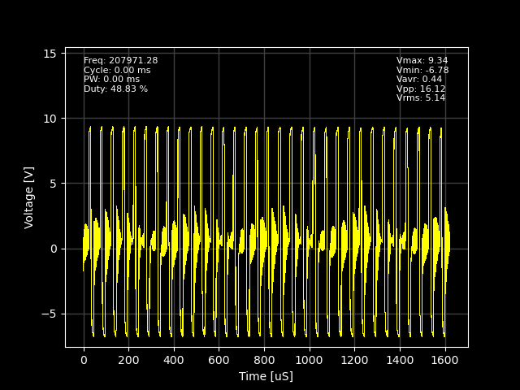
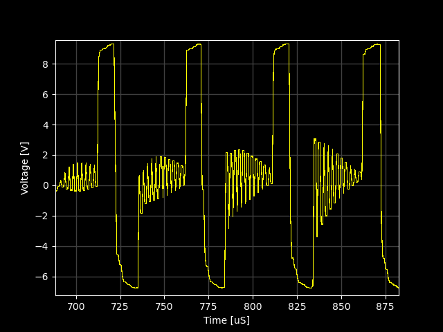
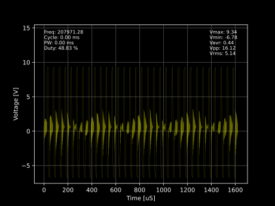

# DLO-138_plotter
A simple tool to parse and plot the serial output of the [DLO-138](https://github.com/ardyesp/DLO-138).

Requires [pyserial](https://pyserial.readthedocs.io/en/latest/index.html) and a TTL-to-USB converter.

This is basicly a python script which reads the samples from the DSO-138, parse it, and plot it.

Thus it allows one to display and save the acquired samples.

The samples are displayed using [pyplot](https://matplotlib.org/api/pyplot_api.html) with fancy configurations to imitate scope display.

This is what you see on the DSO-138 display:

The display is small and most of the signal doesn't fit in.
This also means that saving the acqusition is tedious and low quality, and post processing is virtually impossible.

This is the exact same acquisitions as displayed with the plotter:

The whole range appears both vertically and horizontally :)

Zoom in is also possible:

Saving in vector format is possible too, thanks to pyplot's versatility:

